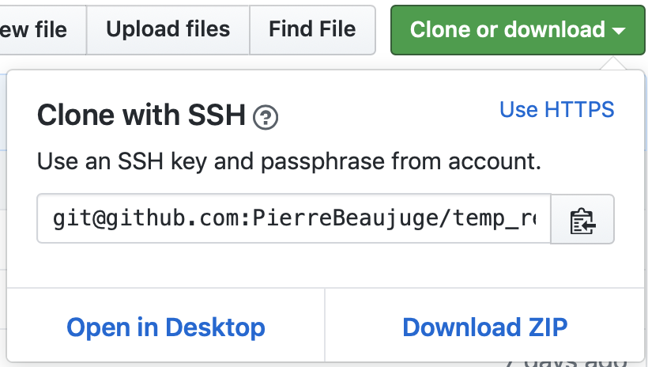

# Simple Shell

## Description 
This is a simple UNIX command line interpreter that replicates functionalities of the shell.

## Installation
1. Clone this repository in your terminal.



2. Compile with the following flags:

```
simple_shell$ gcc -Wall -Werror -Wextra -pedantic *.c -o hsh
```

3. Run program.

```
simple_shell$ ./hsh
```

After successful compilation, the shell is launched and ready for both interactive and non-interactive executions.

### Interactive Mode 
Run program and wait for the prompt `$` to appear. From there, type desired commands. Exit program with the exit command or `Ctrl+D`. 

### Non-Interactive Mode
From command line, use `echo` command and pipe into the program like so:

```bash
simple_shell$ echo "command" | ./hsh
```

## Built-ins Supported
Command Name | Description | Sypnosis 
:---: | :---: | :---:
`exit` | Cause normal process termination | `exit`
`env` | Run a program in a modified environment | `env [OPTION]... [-] [NAME=VALUE]... [COMMAND [ARG]...]`
`ls` | List directory contents | `ls [OPTION]... [FILE]...`

## Examples

```bash
$ /bin/pwd
/home/vagrant/simple_shell
```

```bash
$ env
*prints whole environment*
```

```bash
$ ls
```

## Files

File Name | Description
:---: | :---:
[coolshell.h](./coolshell.h) | Header file with function prototypes, structs and standard libraries.
[coolshell_buf_process.c](./coolshell_buf_process.c) | Functions that read, tokenize and count user input.
[coolshell_builtins.c](./coolshell_builtins.c) | Functions that checks built-ins, print environments and exit shell.
[coolshell_handle_cmd.c](./coolshell_handle_cmd.c) | Functions that handle command with or without PATH directory strings and execute commands.
[coolshell_helpers_1.c](./coolshell_helpers_1.c) | Functions that duplicate and concatenate strings and fill memory with a constant bytes. 
[coolshell_helpers_2.c](coolshell_helpers_2.c) | Functions that return length and turn integers into a string and write characters to standard output.
[coolshell_main.c](./coolshell_main.c) | Main Function that executes command line operations.
[coolshell_path_process.c](coolshell_path_process.c) | Functions that gets, tokenizes, counts, and concatenates an environmental variable string as well as checking the status of a file.

## About
This program was created by:
* **Pierre Beaujuge**

[GitHub: pierrebeaujuge](https://github.com/PierreBeaujuge) | [Medium: pierre.beaujuge](https://medium.com/@pierre.beaujuge) | Email: pierre.beaujuge@gmail.com
* **Joan Cruz**

[GitHub: joancruzz](https://github.com/joancruzz) | [LinkedIn: Joan Cruz](https://www.linkedin.com/in/joancruzprofessionalprofile/) | Email: joan.cruz95@gmail.com
